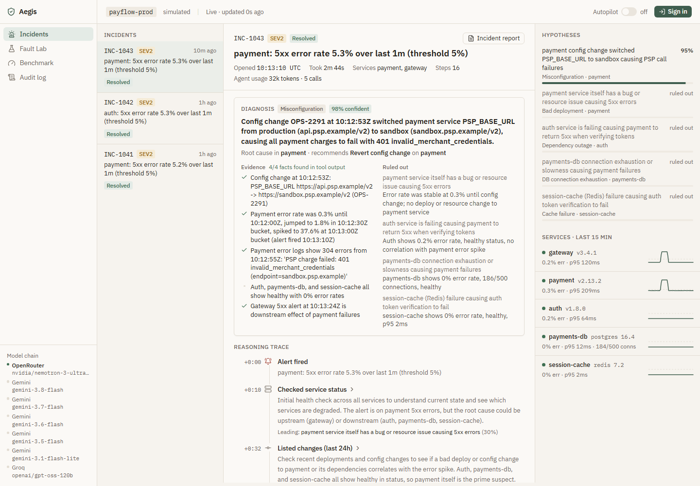
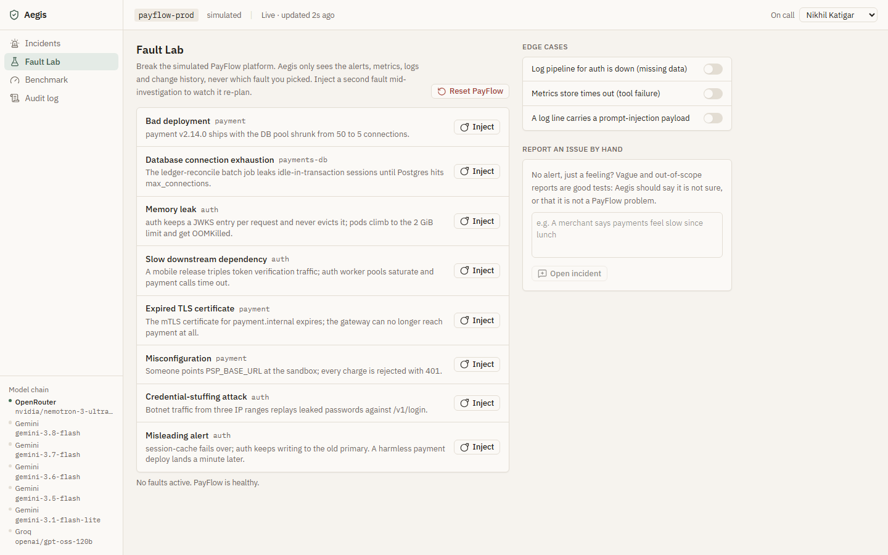
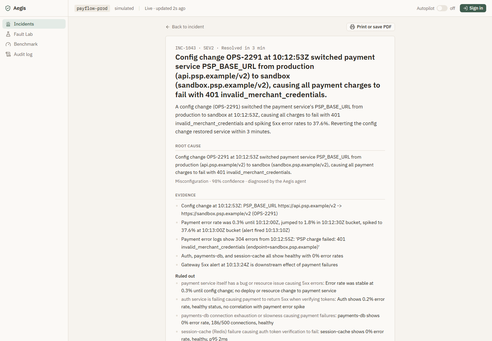
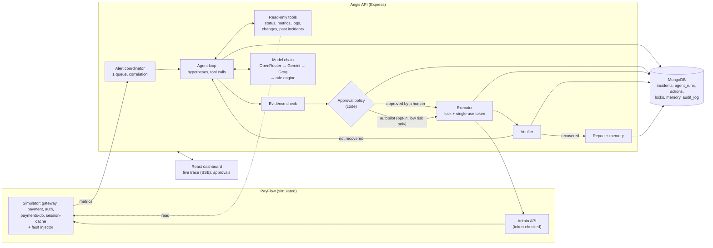
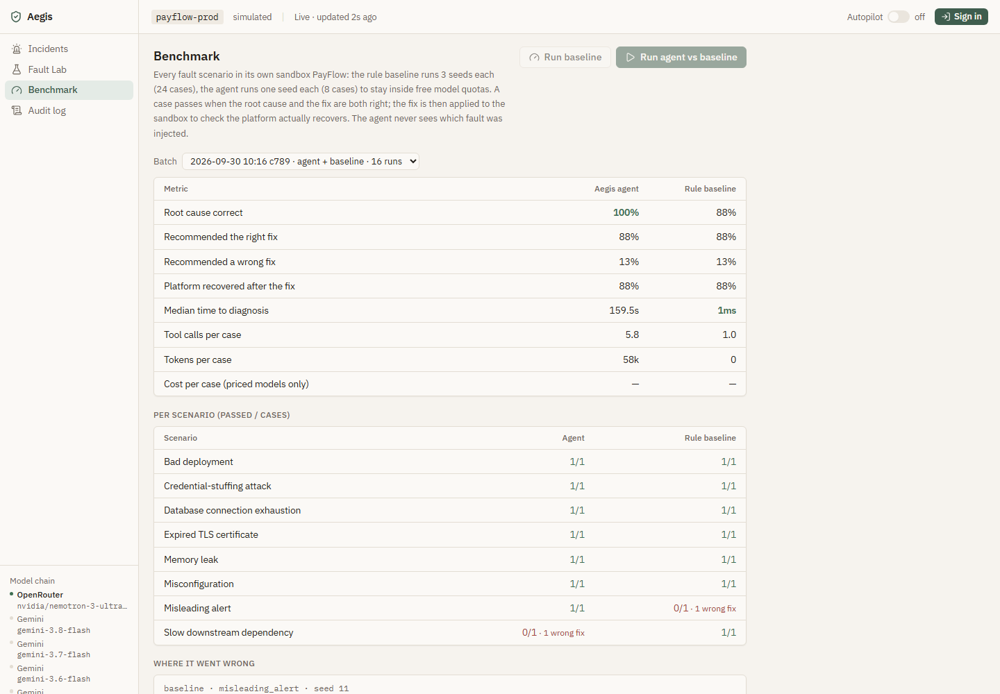

# Aegis: the AI incident response agent

**Team Endgame** · GATEWAYS 2026 · Domain 2, Technology & Cybersecurity · *DevOps Copilot: The AI Incident Response Agent*

Aegis is the on-call engineer's first responder. When an alert fires, it investigates across logs, metrics, service health, recent changes and past incidents, explains the root cause with evidence, proposes the smallest safe fix, **waits for a human to approve anything risky**, checks that the fix actually worked, and writes the incident report.

It runs against **PayFlow**, a simulated payment platform (gateway, payment, auth, Postgres, Redis) that you can break on purpose from the Fault Lab. Aegis is never told which fault you injected. It only sees what a real on-call engineer would see.

**Live demo:** [aegis-ai-incident-response-agent.vercel.app](https://aegis-ai-incident-response-agent.vercel.app) (desktop or laptop only). Sign in as `nikhil` with password `payflow-oncall`.
API: [aegis-ai-incident-response-agent-back.onrender.com/api/health](https://aegis-ai-incident-response-agent-back.onrender.com/api/health). The free Render instance sleeps when idle, so the first request can take about 50 seconds.



---

## Contents

- [The problem](#the-problem)
- [What Aegis does](#what-aegis-does)
- [Try it in 2 minutes](#try-it-in-2-minutes)
- [How it works](#how-it-works)
- [Safety model](#safety-model)
- [Fault scenarios and edge cases](#fault-scenarios-and-edge-cases)
- [Benchmark](#benchmark)
- [Run it locally](#run-it-locally)
- [Deploy it (Vercel + Render + Atlas)](#deploy-it-vercel--render--atlas)
- [Configuration](#configuration)
- [Tests](#tests)
- [Project structure](#project-structure)
- [API](#api)
- [Limitations and honest notes](#limitations-and-honest-notes)
- [Team](#team)

---

## The problem

When a payment service starts returning 500s, the on-call engineer jumps between five tools: logs, dashboards, the deploy history, old tickets and chat. Most of the outage is spent working out *what* broke, not fixing it. The fix itself is risky: a wrong rollback at 3 AM makes things worse. Afterwards nobody has the energy to write the report, so the same problem gets debugged from zero next time.

Most "AI for ops" tools stop at summarising logs. They look at one source, never act, and never check whether the fix worked.

## What Aegis does

```
Alert → Hypothesise → Investigate → Decide → (Approve) → Act → Verify → Report → Remember
```

1. **Alert intake.** A coordinator watches error rate, latency and failed logins, and groups related alerts into one incident using the service dependency map. One cascade opens one investigation, not three.
2. **Hypothesis-driven investigation.** The agent writes ranked hypotheses with confidences, picks the checks that best separate them, and re-ranks after every result. Every step, and the reason for it, streams live to the dashboard.
3. **Explained diagnosis.** The root cause, the evidence (with timestamps and numbers), and the alternatives it ruled out, each with a reason.
4. **Evidence check.** Aegis checks the agent's evidence against what the tools actually returned. Invented numbers lower confidence and force a human decision.
5. **Risk gate in code.** The model proposes; code decides. Risky actions always wait for a signed-in approver.
6. **Execution with guardrails.** A lease lock on the target, then a single-use token that expires in 5 minutes and covers exactly one action on one service.
7. **Verification.** Aegis watches the affected services after the fix. If they are still unhealthy, it re-investigates with that as new evidence, and escalates after two failed attempts.
8. **Report and memory.** Every incident ends with a report (timeline, root cause, evidence, human decisions, actions, verification, prevention). Resolved ones go into incident memory, so the next similar incident is diagnosed faster.

| Fault Lab | Incident report |
|---|---|
|  |  |

## Try it in 2 minutes

1. Open the app and sign in with a demo account (the login page has one-click buttons for them):

   | Username | Password | Role |
   |---|---|---|
   | `nikhil` | `payflow-oncall` | approver: can approve and reject actions, and toggle autopilot |
   | `adithya` | `payflow-oncall` | approver |
   | `priya` | `payflow-oncall` | responder: can investigate and use the Fault Lab, cannot approve |

2. Go to **Fault Lab**, then **Inject** "Bad deployment".
3. Within about 30 seconds an incident opens. Watch the agent's reasoning trace and hypotheses update live.
4. Wherever you are in the app, a **permission prompt** pops up: *"Aegis wants to run an action: rollback → payment · high risk · 99% confident. Do you want to allow this?"* Press **1** to allow, or choose "No, and tell Aegis what to do instead" (Esc decides later). Aegis executes it, verifies recovery and writes the report. The same decision is available in the incident's **Risk gate · Human approval** panel.
5. Then try **Misleading alert**. A harmless payment deploy lands right before the errors, so "roll back payment" is the obvious answer. It is wrong: the real cause is auth holding a stale Redis connection. The agent works this out from timing; the rule engine never does.

Everything, including viewing incidents, needs a signed-in session. Every action is written to the **Audit log** under the signed-in user's name.

## How it works



**The agent loop** (`server/src/agent/investigator.js`) is a hand-written tool-use loop: observe, reason, call tools, read the results, re-plan. Each tool call carries the agent's current hypotheses and the reason for that check, which is what the dashboard shows. New information (a correlated alert, a note from the on-call engineer, a rejected action, a fix that didn't work) is injected between steps, and the agent re-plans visibly. Hard limits: 15 steps, 5 s per tool call, and every tool input and conclusion is validated with Zod.

**Tools** (`server/src/telemetry/tools.js`) are read-only: service status, metrics (30 s buckets to pin down when a problem started), logs, recent changes and past incidents. Raw logs never reach the model. They are grouped into templates with counts, first/last-seen times and samples, capped at about 3,000 tokens per result. Lines that look like instructions to an AI are withheld and reported as a security signal.

**The model chain** (`server/src/agent/llm.js`) sits behind one `chat()` call. Providers run in order: Claude (direct, if a key is set), then OpenRouter, then five Gemini Flash models (each with its own free quota), then Groq. When one hits a rate or credit limit, the next takes over mid-investigation with the same history, and the switch shows up in the trace. If every model fails, the rule engine takes over, so an incident is never left unhandled.

**The rule engine** (`server/src/agent/baseline.js`) is the runbook automation a team would write without an agent. It is used twice: as the last-resort fallback, and as the benchmark baseline.

### Human in the loop, in the UI

- **Permission prompt.** When an incident needs approval, a prompt appears on whatever page you are on, like an AI coding agent asking before it runs a command: *Yes, run it* / *Yes, and don't ask again for low-risk fixes* (only offered for low-risk actions) / *No, and tell Aegis what to do instead*. Number keys choose, and Esc decides later.
- **Risk gate panel** on every incident: what it is waiting for, who approved or rejected what and why, the running action, and the outcome.
- **Lifecycle stepper** (Alert → Investigate → Approval → Action → Verify → Report), a **"needs you" chip** in the top bar, and a count in the browser tab title.
- **Evidence check** marks on every piece of evidence (found / not found in tool output), and a **model chain** indicator showing which provider is answering.

## Safety model

| Control | Where |
|---|---|
| Risk is fixed in code, raised by the target's blast radius. A restart of a tier-0 service (gateway, payment, payments-db) is medium risk; rollback, config revert, certificate rotation, IP blocking and DB session kills are high risk. | `server/src/agent/policy.js` |
| **Autopilot is off by default: every action waits for a human.** An approver can turn it on. Even then it only covers low-risk actions on tier-1/2 services, at 80%+ confidence, with fully grounded evidence, decided by the AI agent. The rule engine never acts on its own. | `policy.js`, top bar switch |
| Every API route except login and the health check needs a session (bcrypt-hashed passwords, JWT that expires after 12 hours). Approvals also need the approver role, and the approver's identity comes from the session token, never from the request body. | `server/src/auth.js`, `routes.js` |
| Signing out revokes the token on the server (a denylist entry that expires with the token), so a copied token stops working at once. The browser drops all incident data, and Back cannot restore it from the page cache. | `auth.js`, `client/src/lib/auth.jsx`, `main.jsx` |
| Brute force: 10 login attempts a minute per IP, and 5 wrong passwords lock that account for 15 minutes (even with the right password afterwards). | `routes.js`, `auth.js` |
| The live stream (SSE) opens with a random one-time ticket that expires after 30 seconds, never with the session token in the URL. Request logs record paths only, never query strings. | `auth.js`, `app.js` |
| The Vercel site sends a strict Content-Security-Policy (own scripts only; API calls only to Render), `X-Frame-Options: DENY`, `nosniff`, `no-referrer` and HSTS. | `client/vercel.json` |
| The agent holds no credentials. The executor takes a lease lock (MongoDB unique index + TTL) on the target, then calls PayFlow's admin API with a JWT that expires in 5 minutes, can be used once, and names the exact action and target. | `incidents/executor.js`, `incidents/locks.js`, `payflow/admin.js` |
| Idempotency key per action, so a retry can never run the same fix twice. | `executor.js` |
| Evidence grounding: numbers, timestamps, versions and quoted log lines in the diagnosis must appear in tool output, or confidence is capped at 55%. | `agent/grounding.js` |
| Log content is treated as data; prompt-injection attempts are withheld and flagged. | `telemetry/compact.js` |
| helmet, CORS allow-list, rate limits (stricter on login), NoSQL-injection sanitising, Zod on every request body. | `app.js`, `routes.js` |
| Audit log of every sign-in, approval, rejection, executed action, autopilot change and Fault Lab change. | `AuditLog` model, Audit log page |

## Fault scenarios and edge cases

| Scenario | What breaks | Correct fix |
|---|---|---|
| Bad deployment | payment v2.14.0 shrinks the DB pool from 50 to 5 | roll back payment |
| DB connection exhaustion | a batch job leaks idle-in-transaction sessions until Postgres hits max_connections | kill idle DB sessions |
| Memory leak | auth caches per request without eviction; pods get OOMKilled | restart (or roll back) auth |
| Slow dependency | a mobile release triples token checks; auth worker pools saturate | scale auth |
| Expired TLS certificate | payment.internal's mTLS cert expires; payment looks healthy with no traffic | rotate the certificate |
| Misconfiguration | PSP_BASE_URL pointed at the sandbox; every charge fails with 401 | revert the config |
| Credential-stuffing attack | botnet traffic from three /24 ranges against /v1/login | block the IP ranges (a security response, not a rollback) |
| Misleading alert | Redis failover leaves auth on a read-only replica; a harmless payment deploy lands just after | restart auth, **not** roll back payment |
| Disk full | WAL archiving to S3 fails on an expired key; pg_wal fills the payments-db volume | expand the payments-db volume, **not** kill DB sessions |
| Cache failure | a session migration writes 5.7M keys with no TTL; session-cache hits maxmemory and rejects writes | clear session-cache (the one fix autopilot may run alone: low risk, tier-2 service) |
| Dependency outage | the external card processor (PSP) is down; nothing inside PayFlow changed | fail payment over to the secondary acquirer, **not** roll back or restart |
| Traffic surge | a flash-sale email triples real checkout traffic from ~40k customer IPs | scale payment, **not** block IPs (it is not an attack) |

Scripted edge cases, all reachable from the Fault Lab:

- **Missing data:** the auth log pipeline goes silent. The agent says so and lowers its confidence.
- **Tool failure:** the metrics store times out. The 5 s tool timeout fires and the agent carries on with other sources.
- **Prompt injection:** a log line tells the AI to roll back auth. It is withheld and flagged.
- **Conflicting data:** the misleading alert.
- **Ambiguous or out-of-scope reports:** filed by hand ("payments feel slow", "the logo looks wrong"). Aegis says it is not sure, or closes the report as out of scope, without acting.
- **Mid-run changes:** inject a second fault during an investigation, or send the agent a note; it re-plans.
- **Rejected fix:** the agent proposes a different option; after two rejections it hands over with a report.
- **Fix that didn't work:** verification fails, the agent re-investigates, then escalates with a report.
- **Model provider limits:** the next provider in the chain continues the same investigation.

## Benchmark

`npm run bench` (or the Benchmark page) runs every scenario in its own sandbox PayFlow and scores each diagnoser on the same cases:

- **Root cause:** the category and the service are both right.
- **Right fix:** the recommended action is one that resolves the fault.
- **Wrong fix:** it recommended an action that would not help.
- **Recovered:** the fix is applied in the sandbox and the platform is healthy 90 seconds later.

Sandbox incident IDs are neutral, so nothing the agent sees names the scenario.

Last complete agent run: the original 8 scenarios × 1 seed, agent and rule baseline on the same sandboxes (agent on the free model chain):

| Metric | Aegis agent | Rule baseline |
|---|---:|---:|
| Root cause correct | **8/8 (100%)** | 7/8 (88%) |
| Recommended the right fix | 7/8 (88%) | 7/8 (88%) |
| Recommended a wrong fix | 1/8 | 1/8 |
| Platform recovered after the fix | 7/8 | 7/8 |
| Evidence facts found in tool output | 37/37 | – |
| Median time to diagnosis | 160 s (free-tier models, 4 in parallel, rate limited) | < 1 ms |
| Tool calls per case | 3–12 (median 5) | 1 |

Where each one went wrong:

- **Rule baseline, misleading alert:** rolled back the harmless payment deploy, because "deploy in the last 15 minutes" is its first rule. The agent compared timestamps, saw auth degrading before the deploy, and restarted auth instead. The baseline fails this in every seed (0/3 in the 24-case baseline run).
- **Agent, slow dependency:** it found the right cause (auth's worker pool saturated) but recommended a restart, leaning on a past incident where a restart had helped. Its own fallback suggestion, *scale auth*, was the right fix. In a live incident the verifier would see the restart fail and send the agent back with that as new evidence. The benchmark gives one shot, so this counts as a miss.

**All 12 scenarios, rule baseline, 3 seeds each (36 cases):** 33/36 right root cause, right fix and recovered. It fails only the misleading alert, in every seed. On the 4 newer scenarios (disk full, cache failure, dependency outage, traffic surge) it recommends the right fix in 12/12 cases.

The agent has not yet been benchmarked on the 4 newer scenarios. The attempt on 30 Sept ran out of free-tier model quota (OpenRouter, Gemini and Groq daily limits) partway through, so 10 of its 12 cases got no model answer. That run measured quota, not the agent, so it is not reported here. Rerun with `npm run bench -- --agent --seeds=1` once quotas reset or with a paid key.

The rule baseline was written knowing these faults, so it is a strong baseline. The interesting number is the gap: the case where the obvious fix is wrong. The agent runs one seed per scenario because the free model tiers allow only a few hundred calls per day. To run the full 24 agent cases, use `npm run bench -- --agent` with a paid key.



## Run it locally

**Windows, one click:** double-click `start.bat`. It installs packages if needed, starts a local MongoDB on port 27018 (data in `.mongo-data/`), the API on :4000 and the UI on :5173, then opens the browser.

**Any OS, by hand:**

```bash
# 1. MongoDB: a local mongod, or a free Atlas cluster (see below)
mongod --dbpath ./.mongo-data --port 27018

# 2. API
cd server
cp .env.example .env        # add at least one model key; without one Aegis uses its rule engine
npm install
npm start                    # http://localhost:4000/api/health

# 3. UI (second terminal)
cd client
cp .env.example .env         # VITE_API_URL=http://localhost:4000/api
npm install
npm run dev                  # http://localhost:5173
```

Requirements: Node.js 20+ and MongoDB 7+ (local or Atlas). Demo accounts and past incidents are seeded on first start.

## Deploy it (Vercel + Render + Atlas)

The repo holds both apps. Each platform builds its own folder: **Vercel builds `client/`**, **Render runs `server/`**, and **MongoDB Atlas** is the database.

### 1. Database: MongoDB Atlas (free M0)

1. Create a free cluster at [cloud.mongodb.com](https://cloud.mongodb.com).
2. **Database Access:** add a database user with a password.
3. **Network Access:** add `0.0.0.0/0`, because Render's outbound IPs change.
4. **Connect → Drivers:** copy the connection string and add the database name, for example:
   `mongodb+srv://aegis:<password>@cluster0.xxxxx.mongodb.net/aegis?retryWrites=true&w=majority`

### 2. API: Render

**Blueprint:** Render dashboard → **New → Blueprint** → pick this repo. It reads `render.yaml` (root directory `server`, `npm ci`, `npm start`, health check `/api/health`, and generated `ACTION_SIGNING_SECRET` and `JWT_SECRET`). Fill in when asked:

| Variable | Value |
|---|---|
| `MONGODB_URI` | the Atlas string from step 1 |
| `CLIENT_ORIGIN` | your Vercel URL from step 3, e.g. `https://aegis-endgame.vercel.app` (no trailing slash). Put anything for now and update it after step 3. |
| `OPENROUTER_API_KEY`, `GEMINI_API_KEY`, `GROQ_API_KEY` | any you have; empty ones are skipped |

**Or by hand:** New → Web Service → this repo, with **Root Directory** `server`, **Build Command** `npm ci`, **Start Command** `npm start`, and the variables above plus `NODE_ENV=production`, `ACTION_SIGNING_SECRET` and `JWT_SECRET` (long random strings).

Check `https://<your-service>.onrender.com/api/health`. It should say `"db":"up"`.

### 3. UI: Vercel

1. [vercel.com](https://vercel.com) → **Add New → Project** → import this repo.
2. **Root Directory:** `client` (click Edit next to it). The framework is detected as Vite, and `client/vercel.json` adds the rewrite that makes deep links like `/incidents/…` work.
3. **Environment variable:** `VITE_API_URL` = `https://<your-service>.onrender.com/api`
4. Deploy.

### 4. Connect the two

Back on Render, set `CLIENT_ORIGIN` to the exact Vercel URL and redeploy. Browsers only accept API responses from origins on that list.

> Render's free plan sleeps after 15 idle minutes, and the first request takes about 50 seconds to wake it. Open `/api/health` a few minutes before a demo. Waking up also restarts the simulator with 20 fresh minutes of healthy history; incidents, reports and the audit log live in Atlas and are kept.

## Configuration

All server settings are environment variables, validated at startup (`server/src/config.js`); see `server/.env.example`.

| Variable | Default | Purpose |
|---|---|---|
| `MONGODB_URI` | `mongodb://127.0.0.1:27018/aegis` | database |
| `CLIENT_ORIGIN` | `http://localhost:5173` | CORS allow-list, comma-separated |
| `LLM_ORDER` | `anthropic,openrouter,gemini,groq` | model failover order; providers without a key are skipped |
| `ANTHROPIC_API_KEY` / `AGENT_MODEL` | – / `claude-opus-5` | Claude direct |
| `OPENROUTER_API_KEY` / `OPENROUTER_MODEL` | – / `nvidia/nemotron-3-ultra-550b-a55b:free` | set `anthropic/claude-sonnet-5` once the account has credits |
| `GEMINI_API_KEY` / `GEMINI_MODELS` | – / five Flash models | rotated, each has its own free quota |
| `GROQ_API_KEY` / `GROQ_MODEL` | – / `openai/gpt-oss-120b` | fast last-resort model |
| `AGENT_MAX_STEPS`, `TOOL_TIMEOUT_MS` | `15`, `5000` | agent guardrails |
| `VERIFY_WINDOW_SEC` | `120` | how long the verifier watches after a fix |
| `ACTION_SIGNING_SECRET`, `JWT_SECRET` | dev values | **must** be set in production (the server refuses to start otherwise) |
| `SEED_USER_PASSWORD` | `payflow-oncall` | password for the seeded demo accounts |

The client has one variable: `VITE_API_URL`.

## Tests

```bash
cd server && npm test
```

The suite uses Node's built-in test runner, needs no extra packages, and runs in about 35 seconds:

- **Security:** every read needs a session (401 without one); a signed-out token is rejected at once; stream tickets work once; five wrong passwords lock the account.
- **Approval policy:** blast radius, autopilot rules, the rule engine never acting alone, weak evidence blocking autopilot.
- **Evidence grounding** and **log compaction**, including prompt-injection lines being withheld.
- **Every fault scenario:** fires an alert, its correct fix recovers the platform, and a wrong fix does not.
- **End to end against MongoDB:** approvals refused without sign-in (401) and for a responder (403); an approver's approval executes with a single-use token, verifies and writes a report; a rejection escalates with a report and runs nothing.
- **The admin API** refuses missing and forged tokens.

The workflow tests use a separate `aegis_test` database and the rule engine, so they spend no model quota.

## Project structure

```
client/                      React (Vite) + Tailwind + Motion
  src/pages/                 Incidents, Fault Lab, Benchmark, Audit log, Report, Login
  src/components/incident/   trace, diagnosis, hypotheses, approval card
  src/lib/                   API client, live events (SSE), auth
server/                      Node.js + Express + MongoDB
  prompts/                   system prompts for the agent and the report writer
  src/agent/                 agent loop, model chain, tools schema, policy, grounding, rule engine
  src/incidents/             coordinator, lifecycle, executor, locks, verifier, report
  src/payflow/               simulator, scenarios, topology, admin API
  src/telemetry/             read-only tools and log compaction
  src/benchmark/             sandbox benchmark
  test/                      node:test suite
docs/                        concept, plan, design system, architecture diagram, screenshots
start.bat                    one-click local start (Windows)
render.yaml                  Render blueprint for the API
```

## API

Everything except login, health and the ticketed stream needs `Authorization: Bearer <token>` from `POST /api/auth/login`.

| Method | Path | Who |
|---|---|---|
| `POST` | `/api/auth/login` | anyone (rate limited) |
| `GET` | `/api/health` | anyone: `{status, db}` only, for deploy checks |
| `POST` | `/api/auth/logout` | signed in: revokes the token |
| `GET` | `/api/platform`, `/api/incidents`, `/api/incidents/:id`, `/api/audit`, `/api/benchmark`, `/api/lab`, `/api/status` | signed in |
| `POST` → `GET` | `/api/events/ticket` → `/api/events?ticket=…` | signed in: one-time ticket, then server-sent events |
| `POST` | `/api/incidents/:id/approve`, `/api/incidents/:id/reject` | approver |
| `PUT` | `/api/settings/autopilot` | approver |
| `POST` | `/api/incidents` (manual report), `/api/incidents/:id/notes`, `/api/incidents/:id/resolve` | signed in |
| `POST` | `/api/lab/faults`, `/api/lab/chaos`, `/api/lab/reset`, `/api/benchmark` | signed in |
| `POST` | `/payflow/admin/actions` | executor only, with a single-use action token |

Responses are `{ success: true, data }` or `{ success: false, message }`.

## Limitations and honest notes

- **PayFlow is a simulator.** The problem statement allows simulated incidents. Its telemetry is generated from fault models, but actions really change its state, and the verifier only reports recovery when the metrics recover.
- **Free model tiers are small.** Gemini allows 20 requests a day per model, OpenRouter's free models about 50 a day, and Groq 8,000 tokens a minute. One investigation takes 4 to 7 model calls. The chain and the rule-engine fallback keep incidents moving, but a paid key makes the agent faster and more consistent.
- **Agent conversations are held in memory.** After a restart, interrupted incidents are picked up again: re-investigated, or re-verified if the fix already ran. The earlier conversation itself is not restored; its steps remain in the trace.
- **The simulator runs in one process.** At scale the coordinator's queue, the SSE bus and the simulator would move to a message queue and a real observability stack. The lock, token and idempotency design already assumes more than one worker.
- **Demo passwords are published here on purpose,** so judges can sign in. Change `SEED_USER_PASSWORD` (and the seeded accounts) for any real use.

## Team

**Team Endgame**

- **Nikhil Katigar** (JUPG26MCA14471, MCA): development: agent, backend, dashboard
- **Adithya V Valke** (JUPG26MCA12680, MCA): pitch, documentation, demo script and test scenarios

All code was written during the hackathon. No UI kit or template was copied: every component is built from our own design tokens (`docs/DESIGN_SYSTEM.md`), with `lucide-react` icons and the `motion` library for transitions.

Component sources, as the build guide requires:

| Component | Source |
|---|---|
| `SegmentedControl` (incident filter) | Pattern adapted from 21st.dev "Segmented Tabs" by micka_design (#26923), found through the 21st.dev MCP; rebuilt on `motion` `layoutId` with our tokens, without its Base UI dependencies |
| Everything else | Written for this project |

The design system was generated with the ui-ux-pro-max skill and then filtered through our own rules (see `docs/DESIGN_SYSTEM.md`); its UX checklist drove the skip link, contextual live status for pending approvals, and the stepper's screen-reader text.
