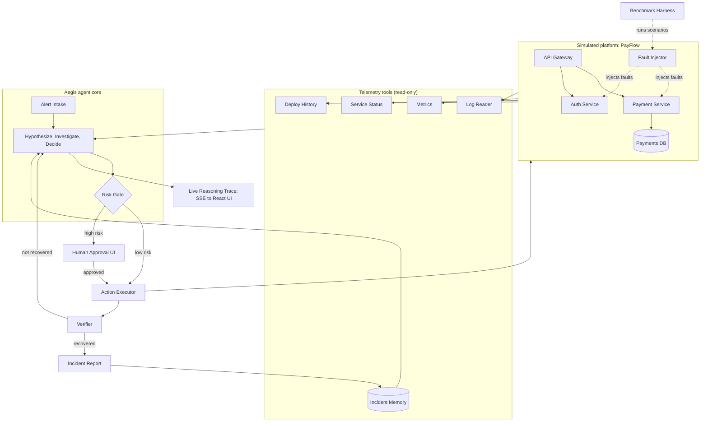

# Aegis: Autonomous Incident Response Agent

## Project Title
**Aegis — an AI incident response agent that investigates, acts safely, verifies its own fix, and proves its accuracy with a benchmark.**

## Domain
Technology & Cybersecurity — *DevOps Copilot: The AI Incident Response Agent*

## Problem Statement
When a production service starts failing, an on-call engineer has to manually open logs, service dashboards, the deployment history, and old incident tickets, then piece together a cause under time pressure. The investigation is slow, depends on who happens to be on call, and the fix itself is risky: a wrong rollback or restart can make the outage worse.

Existing "AI for ops" tools mostly summarize logs. They do not investigate across several sources, they do not take safe action, and they never check whether the fix actually worked. Nobody can tell how accurate they are.

## Proposed Solution
Aegis is an agent that runs the full incident loop on its own, with a human in control of anything risky:

**Alert → Hypothesize → Investigate → Decide → (Approve) → Act → Verify → Report**

1. **Alert intake.** An alert fires (for example, a spike of HTTP 500 errors in the payment service).
2. **Hypothesis-driven investigation.** The agent forms several ranked hypotheses, each with a confidence score. It picks the tools that would confirm or eliminate each one, and it updates the ranking as evidence arrives. New signals that show up mid-investigation change the plan.
3. **Evidence from multiple sources.** Application logs, service status, metrics (error rate, p95 latency, memory), recent deployments and config changes, and **past incidents** retrieved from an incident memory.
4. **Explained diagnosis.** The agent names the most likely root cause and shows the evidence chain behind it, including the hypotheses it ruled out and why.
5. **Risk-tiered action.** Every possible action carries a risk level. Low-risk actions (restart a service, clear a cache, scale up) can run automatically and are logged. High-risk actions (rollback a deployment, change configuration, block traffic, rotate credentials) **stop and wait for human approval**.
6. **Verification.** After acting, the agent re-checks live metrics over a time window. If the service has not recovered, it reopens the investigation and escalates instead of declaring success.
7. **Incident report.** It generates a report: timeline, root cause, evidence, action taken, verification result, and a prevention suggestion. The report is saved to incident memory so the next similar incident is diagnosed faster.

**What makes this different**
- **It is measured, not just demonstrated.** A built-in benchmark runs the agent against 12 injected fault scenarios, several runs each, and compares it to a simple rule-based baseline. We report root-cause accuracy, time-to-diagnosis, wrong-action rate, and cost per run.
- **Security-aware.** Logs are untrusted input, so the agent treats their content strictly as data (defence against prompt injection hidden in log lines). Tool arguments are validated against an allowlist. Security incidents (credential-stuffing spikes, exposed keys) are handled with containment actions that require approval.
- **Safe by design.** Risk gate, approval step, step limits, timeouts, idempotent actions, and a full audit trail of everything the agent saw and did.

## Key Features
1. **Multi-source investigation** across logs, service status, metrics, deployment history, and past incidents.
2. **Hypothesis ranking with confidence** and a live reasoning trace showing what the agent checked, what it concluded, and why.
3. **Adaptive re-planning** when new evidence contradicts the leading hypothesis.
4. **Risk-tiered actions** with a human approval screen for risky steps (rollback, config change, traffic block, credential rotation).
5. **Post-action verification** with automatic escalation if the fix did not work.
6. **Auto-generated incident report** stored in an incident memory that improves future diagnosis.
7. **Fault injection sandbox** with 12 scenarios: bad deployment, database connection exhaustion, memory leak, slow downstream dependency, expired certificate, misconfiguration, disk full, cache failure, dependency outage, traffic surge, credential-stuffing attack, and a misleading alert (symptom in one service, cause in another).
8. **Benchmark dashboard** comparing the agent against a rule-based baseline.
9. **Security guardrails:** untrusted-log handling, validated tool calls, audit log.

## Technology Stack
| Layer | Technology |
|---|---|
| Frontend | React (Vite), Tailwind CSS, Motion for subtle transitions |
| Backend | Node.js, Express |
| Database | MongoDB (Atlas): incidents, agent runs, telemetry, incident memory |
| Agent / LLM | Claude API for reasoning and report writing; tool-calling loop; Zod-validated structured outputs |
| Live updates | Server-Sent Events (SSE) for the streaming reasoning trace |
| Simulated platform | Small Node.js microservice demo ("PayFlow": gateway, payment, auth) with a fault injector |
| Security | Zod validation, helmet, rate limiting, action allowlist, audit logging |
| Deployment | Vercel (frontend), Render (backend), MongoDB Atlas |

## Architecture Diagram

## External Datasets / Sources
- **No external datasets are required.** All logs, metrics, deployments, and incidents are **synthetic**, generated by our own fault injector and modelled on common real-world failure patterns (HTTP 5xx bursts after a release, connection pool exhaustion, memory growth, certificate expiry, credential-stuffing patterns).
- The LLM (Claude API) is the only third-party service, used through our own API key.

## Edge Cases Handled
- **Misleading symptom:** errors appear in the payment service, but the cause is a slow auth dependency, not the latest deploy. The agent must reject the obvious "roll back" answer with evidence.
- **Fix did not work:** a rollback does not restore the error rate, so the agent reopens the investigation instead of declaring success.
- **Human rejects the action:** the agent proposes the next-best safe option instead of stopping.
- **Two faults at once,** and **missing or noisy logs,** where the agent states lower confidence and asks for a human decision.
- **LLM API failure or timeout:** falls back to rule-based diagnosis so the incident is never left unhandled.
- **Prompt injection hidden in a log line:** treated as data and flagged, never followed.

## Demo Plan (Round 3)
1. PayFlow is healthy. We inject a **bad deployment** live. HTTP 500s spike and an alert fires.
2. The agent investigates on screen, links the spike to the deploy, and rules out "database down" with evidence.
3. It proposes a **rollback** and waits for approval. We approve.
4. It verifies recovery over a time window and generates the incident report.
5. **Twist:** we inject a **credential-stuffing spike**. The agent recognises an attack rather than a bug, proposes containment instead of a rollback, and flags it for security review.
6. We close with the **benchmark dashboard** against the rule-based baseline.
